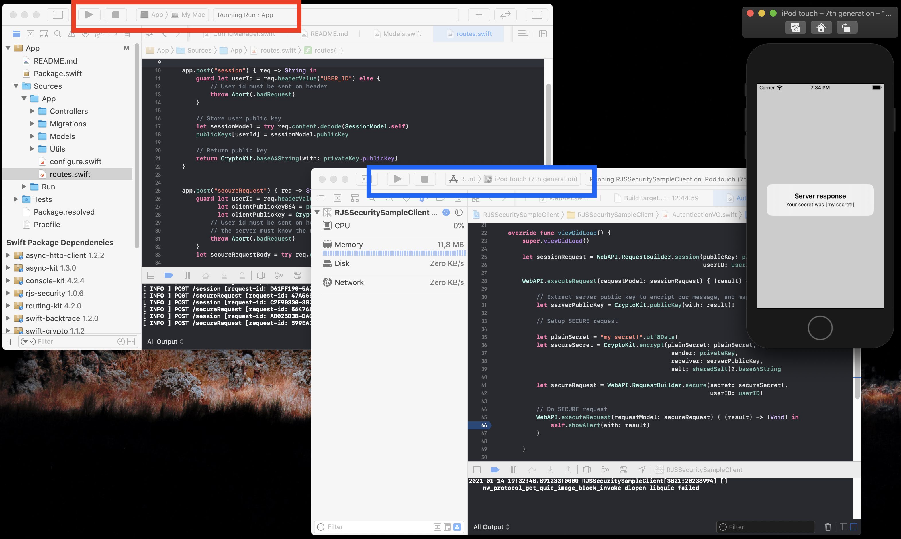

<p align="center">
   <a href="https://developer.apple.com/swift/">
      
   </a>
    <a href="https://developer.apple.com/swift/">
      
   </a>
   <a href="https://github.com/apple/swift-package-manager">
      
   </a>
   <a href="https://twitter.com/ricardo_psantos/">
      
   </a>
</p>

## About

Utilities arround [Apple CryptoKit](https://developer.apple.com/documentation/cryptokit)

## Sample Usage

```swift

struct AliceSender {
    private init() { }
    static let privateKey = CryptoKit.generatePrivateKey()
    static let publicKey  = privateKey.publicKey
}
 
struct BobReceiver {
    private init() { }
    static let privateKey = CryptoKit.generatePrivateKey()
    static let publicKey  = privateKey.publicKey
}

let secret = "my secret!"

guard let salt = "ba00524d-ad11-46ac-a596-0a2998588b5a".utf8Data,
      let message = secret.utf8Data else {
    // Invalid salt or secret
    return ""
}

// Enconding public key so that it can be sent to the receiver
let base64String = CryptoKit.base64String(with: BobReceiver.publicKey)
let bobPublicKey = CryptoKit.publicKey(with: base64String)!

let senderSymmetricKey = CryptoKit.generateSymmetricKeyBetween(AliceSender.privateKey, and: bobPublicKey, salt: salt)!
let encryptedData      = CryptoKit.encrypt(plainSecret: message, using: senderSymmetricKey)!

let reveiverSymmetricKey = CryptoKit.generateSymmetricKeyBetween(BobReceiver.privateKey, and: AliceSender.publicKey, salt: salt)!
let decryptedData        = CryptoKit.decrypt(encryptedData: encryptedData, using: reveiverSymmetricKey)

```

## Sample working projects

Inside the folders __RJSecuritySampleClient__ and __RJSecuritySampleServer__ can be found sample client app (Swift) and sample server (Vapor Swift) ready to use. 

Booth the client app and server use RJSP_Security lib installed via SPM and are a live working example of the key exchange process, and then secure comunication.

Open both projects on Xcode, start the server (first), and then start the app.



The example flow is as follows:

* The app (client) send is public key to the server (on the request body). Also sends his userID (on the request header). 
* The server store the userID and the user public key (for future secure comunication) and returns to the client app the server public key.
* The app (client) receives the server public key, and then with is (client) private key do a secure/encripted request to the server.
* The server receives the encripted request, and decript it using the client public key (stored on setep 1) and his (server) private key. After decripting the message, the server just return it as a "proof" of sucess.